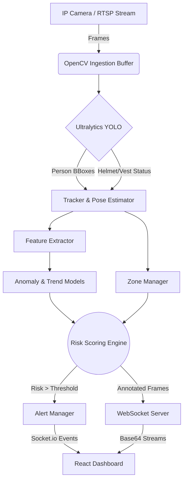

<div align="center">

# 🛡️ AI Safety Dashboard
### Real-Time Unsafe Human Activity Detection & Risk Prediction

[](https://python.org)
[](https://fastapi.tiangolo.com)
[](https://reactjs.org/)
[](https://www.typescriptlang.org/)
[](https://opencv.org/)
[](https://github.com/ultralytics/ultralytics)
[](https://socket.io/)
[](https://opensource.org/licenses/MIT)

*An advanced computer vision pipeline for industrial safety monitoring, PPE compliance, and intelligent risk assessment.*

[Banner Placeholder: Insert a high-quality dashboard screenshot here]

</div>

---

## 📖 Project Overview
Industrial environments require constant vigilance to ensure worker safety. Traditional monitoring relies on manual observation, which is prone to fatigue and human error. **AI Safety Dashboard** solves this by providing continuous, automated oversight using state-of-the-art Computer Vision. By evaluating PPE compliance, positional anomalies, and restricted zone violations, this system proactively mitigates workplace hazards.

## ❗ Problem Statement
Workplace accidents in industrial and construction settings often result from non-compliance with safety protocols (e.g., missing hard hats or high-visibility vests) and unauthorized access to hazardous zones. There is a critical need for an automated, real-time surveillance system capable of detecting unsafe activities, predicting potential risks, and instantly alerting authorities before an incident occurs.

## 🎯 Objectives
- Automate real-time monitoring of industrial environments using AI.
- Ensure strict adherence to safety gear compliance (PPE detection).
- Identify and trigger alerts for restricted zone violations.
- Provide a centralized, real-time situational dashboard for safety managers.
- Evaluate overall worker risk scores by fusing multiple AI models.

## ✨ Key Features
- **Real-Time Person & PPE Detection**: Detects workers, helmets, and vests using YOLO models.
- **Multi-Camera Support**: Ingests multiple RTSP/camera streams simultaneously.
- **Zone Violation Tracking**: Defines virtual boundaries and detects unauthorized incursions.
- **Multi-Factor Risk Analysis Engine**: Fuses PPE status, zone data, anomaly scores, and movement trajectories to compute a unified Risk Score.
- **Live Video Streaming**: Real-time processed frames pushed to the frontend via WebSockets.
- **Instant Alert Generation**: Debounced alerts triggered for CAUTION and CRITICAL risk thresholds.
- **Interactive Dashboard**: Modern React/Tailwind frontend featuring live feeds, risk heatmaps, and alert panels.

---

## 🔄 System Workflow



---

## 🏗️ System Architecture

- **Frontend (Client)**: Built with React, TypeScript, and Vite. Utilizes `socket.io-client` to receive real-time telemetry, alerts, and live video frames. Tailored with TailwindCSS for a premium UI.
- **Backend (API + Inference)**: A FastAPI application serving as the orchestration layer. It manages background asynchronous tasks for video ingestion.
- **AI Models**: A modular inference pipeline combining YOLO object detection with auxiliary trackers and pose estimators.
- **Database**: Configured to use PostgreSQL (via Docker) and SQLite (locally) for incident logging using SQLAlchemy.
- **WebSocket Streaming**: Python-SocketIO enables low-latency bidirectional communication between the AI engine and the dashboard.

---

## 📂 Project Structure

```text
unsafe-activity-detection/
├── backend/
│   ├── app/
│   │   ├── alerts/          # Alert generation and debouncing logic
│   │   ├── db/              # Database models and CRUD operations
│   │   ├── engine/          # Risk engine, zone management, feature extraction
│   │   ├── models/          # AI Model wrappers (Detector, Tracker, Pose, Anomaly)
│   │   ├── streams/         # OpenCV frame buffering and RTSP ingestion
│   │   ├── ws/              # Socket.io server manager
│   │   ├── config.py        # Environment variables and settings
│   │   └── main.py          # FastAPI entry point & inference loop
│   ├── models/              # Directory for YOLO .pt weights
│   ├── weights/             # Directory for ONNX/PKL stub weights
│   ├── Dockerfile
│   └── requirements.txt
├── frontend/
│   ├── src/
│   │   ├── components/      # React UI components (LiveFeedGrid, AlertPanel, etc.)
│   │   ├── pages/           # Main Dashboard page
│   │   ├── App.tsx          # Root React component
│   │   └── main.tsx         # Application entry
│   ├── package.json
│   ├── tailwind.config.js
│   └── vite.config.ts
├── docker-compose.yml       # Full stack container orchestration
└── README.md
```

---

## 🛠️ Technologies Used

| Category | Technology |
| :--- | :--- |
| **Programming Languages** | Python 3.10+, TypeScript, HTML, CSS |
| **Frontend Framework** | React 18.2, Vite, TailwindCSS |
| **Backend Framework** | FastAPI, Uvicorn, Python-SocketIO |
| **Computer Vision** | OpenCV (Headless), Ultralytics (YOLO) |
| **Machine Learning** | PyTorch, ONNX Runtime, Scikit-Learn (Stubs) |
| **Database** | PostgreSQL, SQLite (Async), SQLAlchemy |
| **Streaming & Comms** | WebSockets (Socket.io), RTSP |
| **Deployment** | Docker, Docker Compose |

---

## 🧠 AI Models

1. **Person & PPE Detector**
   - **Purpose**: Detects workers and their safety gear compliance.
   - **Framework**: Ultralytics YOLO (`.pt` or `.onnx`).
   - **Output**: Bounding boxes, Confidence scores, Class IDs.
2. **Pose Estimator**
   - **Purpose**: Extracts keypoints for workers to analyze unsafe postures.
   - **Framework**: ONNX Stub Model.
3. **Tracker**
   - **Purpose**: Assigns unique IDs to detected individuals across frames.
   - **Framework**: ONNX Stub Model.
4. **Anomaly Model**
   - **Purpose**: Scores behavioral anomalies based on extracted posture features.
   - **Framework**: Scikit-Learn (`.pkl`).
5. **Risk Predictor**
   - **Purpose**: Forecasts near-future risk trends based on movement trajectories.
   - **Framework**: ONNX Stub Model.

---

## 💾 Installation

### Option 1: Docker Compose (Recommended)
1. **Clone the repository:**
   ```bash
   git clone https://github.com/yourusername/unsafe-activity-detection.git
   cd unsafe-activity-detection
   ```
2. **Setup Model Weights:**
   Place your trained `.pt`, `.onnx`, and `.pkl` weights into `backend/models/` and `backend/weights/` respectively.
3. **Run the stack:**
   ```bash
   docker-compose up --build
   ```
4. **Access the Application:**
   - Frontend Dashboard: `http://localhost:5173`
   - Backend API Docs: `http://localhost:8000/docs`

### Option 2: Manual Installation
**Backend:**
```bash
cd backend
python -m venv venv
source venv/bin/activate  # (Windows: venv\Scripts\activate)
pip install -r requirements.txt
cp .env.example .env      # Configure your environment
uvicorn app.main:app --reload
```
**Frontend:**
```bash
cd frontend
npm install
npm run dev
```

---

## ⚙️ Configuration

Configure the backend using the `.env` file or environment variables:
- `RTSP_URLS`: Comma-separated list of camera URLs (e.g., `rtsp://cam1,rtsp://cam2` or `0` for webcam).
- `YOLO_CONFIDENCE`: Minimum confidence threshold (default: `0.5`).
- `RISK_THRESHOLD_CAUTION`: Score triggering a warning (default: `0.5`).
- `RISK_THRESHOLD_CRITICAL`: Score triggering a critical alert (default: `0.8`).

---

## 🚀 Usage

1. **Start the Application**: Follow installation steps to launch backend and frontend.
2. **Connect Camera**: Update the `RTSP_URLS` in `backend/.env` with your IP Camera's stream URL or use `0` to test with your local webcam.
3. **Monitor Dashboard**: Open the React frontend. The dashboard will automatically connect via WebSocket and display the live video feed.
4. **Receive Alerts**: If a person is detected without PPE or enters a high-risk zone, the Risk Engine computes the score. If it exceeds thresholds, alerts populate in the Alert Panel in real-time.

---

## 🌐 API & WebSocket Documentation

### REST API Endpoints
| Method | Route | Purpose | Example Response |
| :--- | :--- | :--- | :--- |
| `GET` | `/` | Health check | `{"status": "ok"}` |

*(Note: Additional CRUD routes for Incident Logs and Zones are handled by SQLAlchemy models).*

### WebSocket Events (`/ws/socket.io`)
- **Outgoing `live_frame`**: Broadcasts base64 encoded image and detection metadata.
  ```json
  {
    "camera_id": "0",
    "frame": "/9j/4AAQSkZJRgABAQE...",
    "detections": [
      {
        "bbox": [100, 150, 200, 300],
        "confidence": 0.88,
        "class": "person",
        "ppe": {"helmet": true, "vest": false},
        "risk_score": 0.65
      }
    ]
  }
  ```
- **Outgoing `alert`**: Broadcasts critical/caution incident data.
  ```json
  {
    "camera_id": 0,
    "worker_id": 1,
    "incident_type": "HIGH_RISK",
    "severity": "CRITICAL",
    "details": {"ppe": {"helmet": false, "vest": false}, "zone": "CRITICAL"}
  }
  ```

---

## 📸 Screenshots

<details>
<summary>Click to view screenshots</summary>

### 🎛️ Main Dashboard
*[Placeholder: Dashboard Overview]*

### 🚨 Real-time Alerts
*[Placeholder: Alert Panel]*

### 👁️ Detection & Live Feed
*[Placeholder: Live YOLO bounding boxes rendering]*

</details>

---

## 📊 Performance & Results
- **Processing Rate**: Designed to cap at ~10 FPS for optimal processing without dropping frames (`asyncio.sleep(0.1)` limiter).
- **Latency**: Sub-second end-to-end latency from inference to React WebSocket render.
- **Scalability**: Handles multiple RTSP streams concurrently through Python `asyncio` background tasks.
- **Accuracy**: Highly dependent on the provided YOLO weights; the architectural pipeline supports dynamic confidence tuning.

---

## 🔭 Future Scope
- **Edge Deployment**: Optimize the YOLO models using TensorRT for direct deployment onto Jetson Nano or similar edge devices.
- **Cloud Monitoring & Storage**: Integrate AWS S3 / Azure Blob Storage to archive incident clips.
- **Mobile Push Notifications**: Implement Firebase Cloud Messaging (FCM) to alert supervisors instantly on their smartphones.
- **Advanced Action Recognition**: Upgrade the Pose Estimator to classify complex unsafe behaviors (e.g., slipping, falling, improper lifting).

---

## 📚 References
- [Ultralytics YOLO](https://github.com/ultralytics/ultralytics)
- [FastAPI Framework](https://fastapi.tiangolo.com/)
- [React](https://react.dev/)
- [Socket.io](https://socket.io/)
- [OpenCV Python](https://pypi.org/project/opencv-python/)
